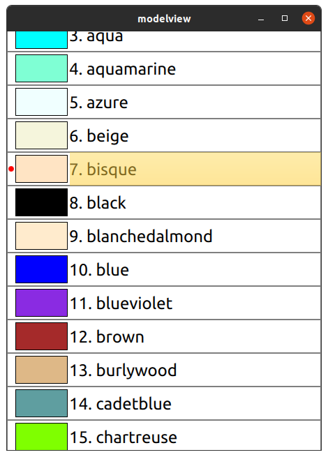

# ModelViewExample

This project demonstrate how to use C++ model in Qt Quick view. This example is inspired from [qtqml book](https://qmlbook.github.io/ch17-qtcpp/qtcpp.html#models-in-c) chapter-17, Models in C++. 

## How to build
The project can be built using either `qmake` or `cmake` build tool.

### Build using qmake tool
```shell
# clone this repo 
git clone https://github.com/aamirglb/ModelViewExample.git
cd ModelViewExample
mkdir build && cd build
qmake CONFIG+=release ..
make

# To run the application
./modelview
```

### Build using CMake tool
```shell
# clone this repo 
git clone https://github.com/aamirglb/ModelViewExample.git
cd ModelViewExample
mkdir build && cd build
cmake -DCMAKE_BUILD_TYPE=Release ..
cmake --build .

# To run the application
./modelview
```

### Application Output

